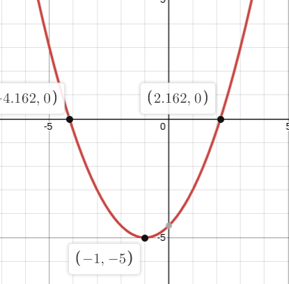

+++
title = "Practice"
date = 2022-01-04T14:16:56-05:00
draft = false

unit = 3
lesson = -1
chapter = 4
section = -1
+++

## Question 1


Consider
y=t=0.5(x+1)^2-5.

Direction of opening (either <code>up</code> or <code>down</code>)
up

Stretch or compression factor value
0.5

Stretch or compression factor direction (either <code>vertical</code> or <code>horizontal</code>)
vertical

$sx$e value of the vertex
-1

$sy$e value of the vertex
-5

$sc$e where the axis of symmetry is in the form $sx=c$e.
-1

Is the vertex the maximum or minimum value? (either <code>max</code> or <code>min</code>)
min

The maximum/minimum value of $sy$e
-5

The direction of opening is determined by whether a > 0.
Since a = 0.5 > 0, the direction is up.

The stretch or compression factor is determined by putting the two values a and b together.
Similarly, the direction is determined by whether the factor is less than 1.

The vertex can be determined by solving the relation with t=0:
0=0.5(x+1)^2-5
5=0.5(x+1)^2
10=(x+1)^2
x=\sqrt{10}-1
x=-\sqrt{10}-1
The x value of the axis of symmetry is the mean of the two zeroes.
x=\frac{\sqrt{10}-1-\sqrt{10}-1}{2}
x=-1
The vertex is the minimum value because the direction of opening is up.

The minimum value of y is the y value of the vertex.
x=-1
t=0.5(x+1)^2-5
t=0.5(0)^2-5
t=5 

